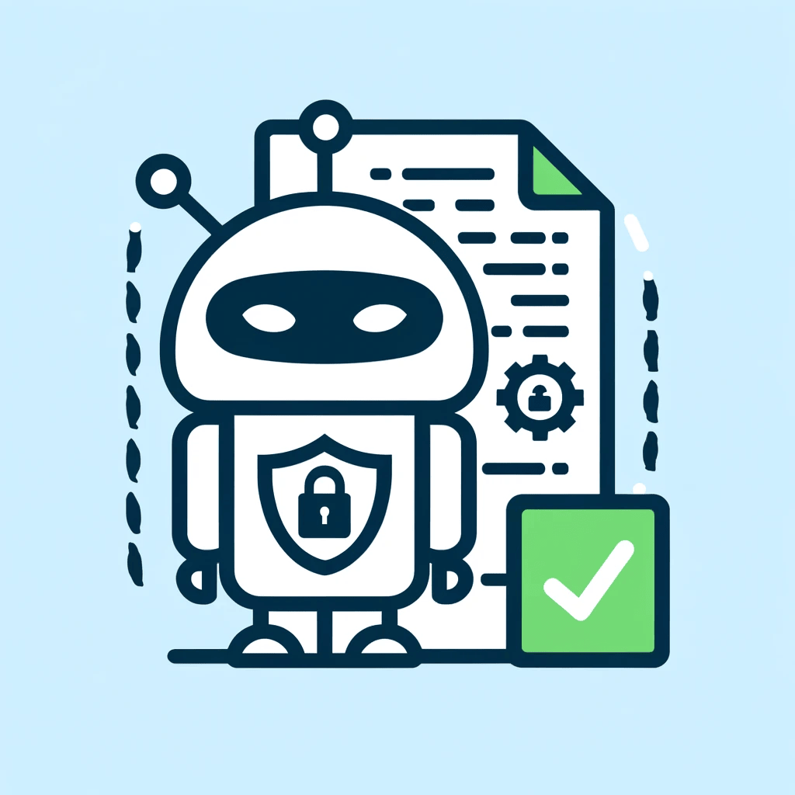

# 🛡️ Audit de Sécurité Réseau avec ChatGPT-4
[](https://nmap.org/)
[](https://www.metasploit.com/)
[](https://www.wireshark.org/)
[](https://github.com/vanhauser-thc/thc-hydra)
[](https://github.com/OJ/gobuster)
[](https://cirt.net/Nikto2)
[](https://www.exploit-db.com/)




## 📝 Description

Ce dépôt contient un rapport détaillé sur un audit de sécurité réseau réalisé en utilisant l'intelligence artificielle ChatGPT-4. Le document inclut la méthode PTES (Penetration Testing Execution Standard), les outils et commandes utilisés pour l'audit, ainsi que des réflexions sur l'usage de l'IA en cybersécurité.

## 📂 Contenu du Dépôt

- `Audit_de_sécurité_par_l_IA_Chat_GPT-4o.docx` : Le rapport complet de l'audit de sécurité.
- `Markmap_Audit_Securite_ChatGPT.html` : Un Markmap détaillant les différentes sections et commandes utilisées dans le rapport.

## 🛠️ Méthodologie

L'audit suit la méthode PTES et comprend les étapes suivantes :

1. **Pré-engagement Interactions**
2. **Intelligence Gathering (Reconnaissance)**
3. **Threat Modeling**
4. **Vulnerability Analysis**
5. **Exploitation**
6. **Post-Exploitation**
7. **Reporting**

## 💻 Commandes Utilisées

### 🔍 Reconnaissance
```bash
nmap -sV
```
### 📁 Exploration des Répertoires
```bash
gobuster dir -u http://[target] -w /usr/share/wordlists/dirb/common.txt
curl http://[target]/robots.txt
```
### 🛠️ Utilisation d'Outils

#### Metasploit
```bash
msfconsole
search exploit
use exploit/multi/http/[exploit_name]
set RHOST [target_ip]
run
```
#### SecList
```bash
apt-get install seclists
```
#### Gobuster
```bash
apt-get install gobuster
gobuster dir -u http://[target] -w /usr/share/wordlists/dirb/common.txt
```
#### Curl
```bash
curl -L http://[target]
```
#### Hydra
```bash
hydra -l [username] -P /path/to/passwords.txt [target] http-post-form "/login.php:user=^USER^&pass=^PASS^:F=incorrect"
```
## 🤔 Réflexions sur l'IA en Cybersécurité

- **Risques Engendrés** : Automatisation des attaques par des cybercriminels.
- **Éthique** : Questions sur la vie privée et les libertés individuelles.
- **Réglementation** : Limiter l'accès et les capacités de l'IA pour éviter les abus.
- **Peur de l'IA** : Se préparer aux menaces potentielles.

## 🔒 Recommandations

- Mettre à jour les versions des firmwares et logiciels.
- Restreindre l'accès aux pages de configuration.
- Utiliser des mots de passe forts et uniques.

## 📄 License

[Préciser la licence de votre choix, par exemple, MIT License]

---

👤 **Contributeurs**
- [Eloham Caron](https://github.com/caroneloham)

---

📫 **Contact**
- Email : [eloham.caron@gmail.com](mailto:eloham.caron@gmail.com)

Merci d'avoir consulté ce dépôt ! Si vous avez des questions ou des suggestions, n'hésitez pas à me contacter.
